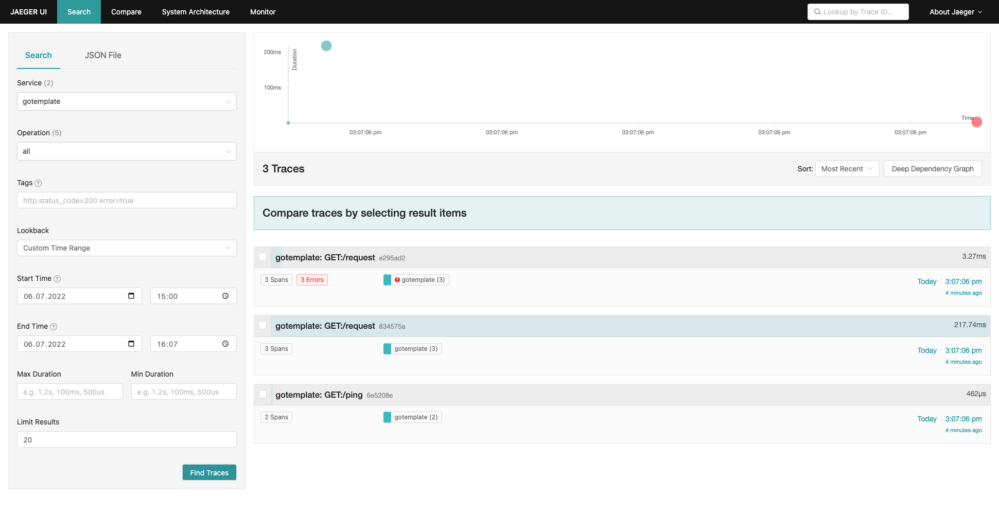

<div align="center">
  
  <br><br>

  A template to bootstrap your next Go project.

  
</div>

**gotemplate** is a template to bootstrap your next Go project. The gotemplate is fully instrumented with metrics, logging and tracing.

## Usage

Clone the repository from GitHub:

```sh
git clone git@github.com:ricoberger/gotemplate.git
```

To test the instrumentation you can start a local Jaeger instance via the following command:

```sh
docker run -d --name jaeger -e COLLECTOR_ZIPKIN_HOST_PORT=:9411 -e COLLECTOR_OTLP_ENABLED=true -p 6831:6831/udp -p 6832:6832/udp -p 5778:5778 -p 16686:16686 -p 4317:4317 -p 4318:4318 -p 14250:14250 -p 14268:14268 -p 14269:14269 -p 9411:9411 jaegertracing/all-in-one:1.35
```

Once Jaeger is running we can build and run the application with the following commands:

```sh
make build
./bin/gotemplate --log.level=debug --trace.enabled
```

Then we can run the following requests via cURL:

```sh
curl -vvv 'http://localhost:8080/ping'
curl -vvv 'http://localhost:8080/request?url=http://example.com'
curl -vvv 'http://localhost:8080/request?url=http://examplefake.com'
```

<details>
  <summary>Logs</summary>

  You should see the following logs in your terminal:

  ```
  2022-07-06T15:06:05.756+0200    info    gotemplate/gotemplate.go:97     Version information     {"version": "", "branch": "main", "revision": "4819e09c01edbb4d8bf019765b4d65cd254f34a5"}
  2022-07-06T15:06:05.757+0200    info    gotemplate/gotemplate.go:98     Build context   {"go": "go1.18.3", "user": "ricoberger", "date": "2022-07-06@15:05:57"}
  2022-07-06T15:06:05.757+0200    info    api/api.go:32   API server started      {"address": ":8080"}
  2022-07-06T15:06:05.757+0200    info    metrics/metrics.go:28   Metrics server started  {"address": ":8081"}
  2022-07-06T15:06:05.757+0200    debug   gotemplate/gotemplate.go:116    Start listining for SIGINT and SIGTERM signal
  2022-07-06T15:07:06.621+0200    info    httplog/httplog.go:40   Request completed       {"requestScheme": "http", "requestProto": "HTTP/1.1", "requestMethod": "GET", "requestAddr": "127.0.0.1:61115", "requestUserAgent": "curl/7.79.1", "requestURI": "http://localhost:8080/ping", "responseStatus": 200, "responseBytes": 16, "requestLatency": 0.167, "requestID": "ricos-mbp2022-work.local/OfledvPbxO-000001", "traceID": "6e5208e02028c1524b6c4d1f49548f1d"}
  2022-07-06T15:07:06.853+0200    info    httplog/httplog.go:40   Request completed       {"requestScheme": "http", "requestProto": "HTTP/1.1", "requestMethod": "GET", "requestAddr": "127.0.0.1:61116", "requestUserAgent": "curl/7.79.1", "requestURI": "http://localhost:8080/request?url=http://example.com", "responseStatus": 200, "responseBytes": 1587, "requestLatency": 217.521291, "requestID": "ricos-mbp2022-work.local/OfledvPbxO-000002", "traceID": "834575ad4a85ef5c604d18680210887a"}
  2022-07-06T15:07:06.876+0200    error   api/handlers.go:41      Request returned an error       {"error": "Get \"http://examplefake.com\": dial tcp: lookup examplefake.com: no such host", "requestID": "ricos-mbp2022-work.local/OfledvPbxO-000003", "traceID": "e295ad29b24e0924374be4337bc75dbd"}
  github.com/ricoberger/gotemplate/pkg/api.requestHandler
          /Users/ricoberger/Documents/GitHub/gotemplate/pkg/api/handlers.go:41
  net/http.HandlerFunc.ServeHTTP
          /opt/homebrew/opt/go/libexec/src/net/http/server.go:2084
  github.com/go-chi/chi/v5.(*Mux).routeHTTP
          /Users/ricoberger/go/pkg/mod/github.com/go-chi/chi/v5@v5.0.7/mux.go:442
  net/http.HandlerFunc.ServeHTTP
          /opt/homebrew/opt/go/libexec/src/net/http/server.go:2084
  github.com/go-chi/render.SetContentType.func1.1
          /Users/ricoberger/go/pkg/mod/github.com/go-chi/render@v1.0.1/content_type.go:52
  net/http.HandlerFunc.ServeHTTP
          /opt/homebrew/opt/go/libexec/src/net/http/server.go:2084
  github.com/ricoberger/gotemplate/pkg/api/middleware/httplog.Logger.func1
          /Users/ricoberger/Documents/GitHub/gotemplate/pkg/api/middleware/httplog/httplog.go:21
  net/http.HandlerFunc.ServeHTTP
          /opt/homebrew/opt/go/libexec/src/net/http/server.go:2084
  github.com/ricoberger/gotemplate/pkg/api/middleware/metrics.Metrics.func1
          /Users/ricoberger/Documents/GitHub/gotemplate/pkg/api/middleware/metrics/metrics.go:35
  net/http.HandlerFunc.ServeHTTP
          /opt/homebrew/opt/go/libexec/src/net/http/server.go:2084
  github.com/ricoberger/gotemplate/pkg/api/middleware/httptracer.traceware.ServeHTTP
          /Users/ricoberger/Documents/GitHub/gotemplate/pkg/api/middleware/httptracer/httptracer.go:46
  github.com/go-chi/chi/v5/middleware.URLFormat.func1
          /Users/ricoberger/go/pkg/mod/github.com/go-chi/chi/v5@v5.0.7/middleware/url_format.go:69
  net/http.HandlerFunc.ServeHTTP
          /opt/homebrew/opt/go/libexec/src/net/http/server.go:2084
  github.com/go-chi/chi/v5/middleware.Recoverer.func1
          /Users/ricoberger/go/pkg/mod/github.com/go-chi/chi/v5@v5.0.7/middleware/recoverer.go:38
  net/http.HandlerFunc.ServeHTTP
          /opt/homebrew/opt/go/libexec/src/net/http/server.go:2084
  github.com/go-chi/chi/v5/middleware.RequestID.func1
          /Users/ricoberger/go/pkg/mod/github.com/go-chi/chi/v5@v5.0.7/middleware/request_id.go:76
  net/http.HandlerFunc.ServeHTTP
          /opt/homebrew/opt/go/libexec/src/net/http/server.go:2084
  github.com/go-chi/cors.(*Cors).Handler.func1
          /Users/ricoberger/go/pkg/mod/github.com/go-chi/cors@v1.2.1/cors.go:228
  net/http.HandlerFunc.ServeHTTP
          /opt/homebrew/opt/go/libexec/src/net/http/server.go:2084
  github.com/go-chi/chi/v5.(*Mux).ServeHTTP
          /Users/ricoberger/go/pkg/mod/github.com/go-chi/chi/v5@v5.0.7/mux.go:88
  net/http.serverHandler.ServeHTTP
          /opt/homebrew/opt/go/libexec/src/net/http/server.go:2916
  net/http.(*conn).serve
          /opt/homebrew/opt/go/libexec/src/net/http/server.go:1966
  2022-07-06T15:07:06.877+0200    info    httplog/httplog.go:40   Request completed       {"requestScheme": "http", "requestProto": "HTTP/1.1", "requestMethod": "GET", "requestAddr": "127.0.0.1:61118", "requestUserAgent": "curl/7.79.1", "requestURI": "http://localhost:8080/request?url=http://examplefake.com", "responseStatus": 400, "responseBytes": 118, "requestLatency": 3.195708, "requestID": "ricos-mbp2022-work.local/OfledvPbxO-000003", "traceID": "e295ad29b24e0924374be4337bc75dbd"}
  ```
</details>

<details>
  <summary>Metrics</summary>

  You can also check the generated metrics at [http://localhost:8081/metrics](http://localhost:8081/metrics):

  ```
  # HELP gotemplate_chi_request_duration_milliseconds Latency of HTTP requests processed, partitioned by status code, method and path.
  # TYPE gotemplate_chi_request_duration_milliseconds summary
  gotemplate_chi_request_duration_milliseconds{request_method="GET",request_path="/ping",response_code="200",quantile="0.5"} 0.388208
  gotemplate_chi_request_duration_milliseconds{request_method="GET",request_path="/ping",response_code="200",quantile="0.9"} 0.388208
  gotemplate_chi_request_duration_milliseconds{request_method="GET",request_path="/ping",response_code="200",quantile="0.95"} 0.388208
  gotemplate_chi_request_duration_milliseconds{request_method="GET",request_path="/ping",response_code="200",quantile="0.99"} 0.388208
  gotemplate_chi_request_duration_milliseconds_sum{request_method="GET",request_path="/ping",response_code="200"} 0.388208
  gotemplate_chi_request_duration_milliseconds_count{request_method="GET",request_path="/ping",response_code="200"} 1
  gotemplate_chi_request_duration_milliseconds{request_method="GET",request_path="/request",response_code="200",quantile="0.5"} 217.703541
  gotemplate_chi_request_duration_milliseconds{request_method="GET",request_path="/request",response_code="200",quantile="0.9"} 217.703541
  gotemplate_chi_request_duration_milliseconds{request_method="GET",request_path="/request",response_code="200",quantile="0.95"} 217.703541
  gotemplate_chi_request_duration_milliseconds{request_method="GET",request_path="/request",response_code="200",quantile="0.99"} 217.703541
  gotemplate_chi_request_duration_milliseconds_sum{request_method="GET",request_path="/request",response_code="200"} 217.703541
  gotemplate_chi_request_duration_milliseconds_count{request_method="GET",request_path="/request",response_code="200"} 1
  gotemplate_chi_request_duration_milliseconds{request_method="GET",request_path="/request",response_code="400",quantile="0.5"} 3.245459
  gotemplate_chi_request_duration_milliseconds{request_method="GET",request_path="/request",response_code="400",quantile="0.9"} 3.245459
  gotemplate_chi_request_duration_milliseconds{request_method="GET",request_path="/request",response_code="400",quantile="0.95"} 3.245459
  gotemplate_chi_request_duration_milliseconds{request_method="GET",request_path="/request",response_code="400",quantile="0.99"} 3.245459
  gotemplate_chi_request_duration_milliseconds_sum{request_method="GET",request_path="/request",response_code="400"} 3.245459
  gotemplate_chi_request_duration_milliseconds_count{request_method="GET",request_path="/request",response_code="400"} 1
  # HELP gotemplate_chi_requests_total Number of HTTP requests processed, partitioned by status code, method and path.
  # TYPE gotemplate_chi_requests_total counter
  gotemplate_chi_requests_total{request_method="GET",request_path="/ping",response_code="200"} 1
  gotemplate_chi_requests_total{request_method="GET",request_path="/request",response_code="200"} 1
  gotemplate_chi_requests_total{request_method="GET",request_path="/request",response_code="400"} 1
  ```
</details>

<details>
  <summary>Traces</summary>

  Finally we can take a look at the generated traces at [http://localhost:16686](http://localhost:16686):

  
</details>
