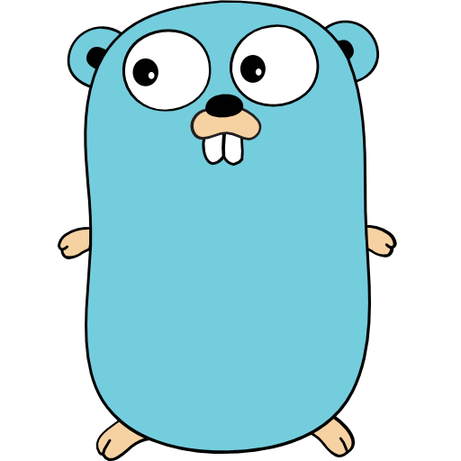
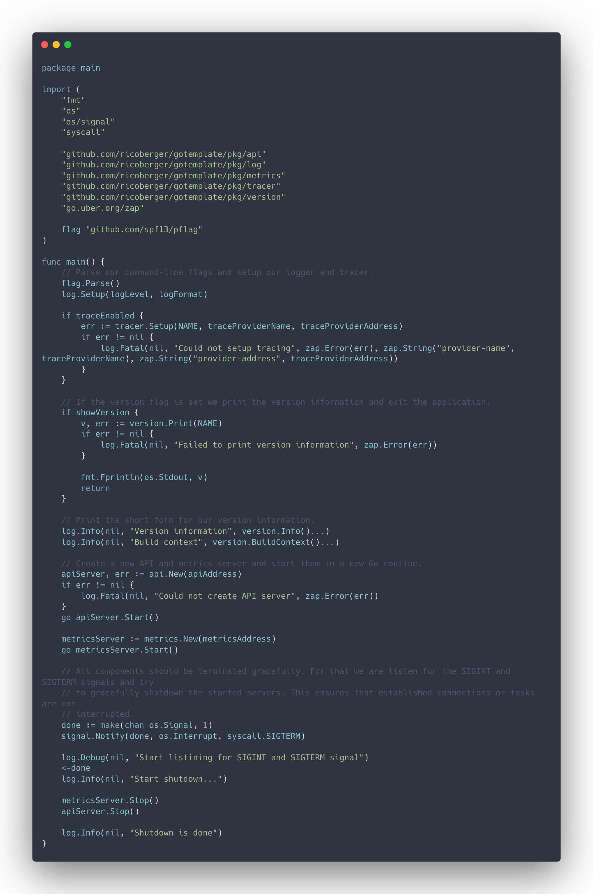

<div align="center">
  
  <br><br>

  A template to bootstrap your next Go Project.

  
</div>

## Installation

See [https://github.com/ricoberger/gotemplate/releases](https://github.com/ricoberger/gotemplate/releases) for the latest release.

```sh
GOOS=$(go env GOOS)
GOARCH=$(go env GOARCH)
wget https://github.com/ricoberger/gotemplate/releases/download/1.0.0/gotemplate-$GOOS-$GOARCH
sudo install -m 755 gotemplate-$GOOS-$GOARCH /usr/local/bin/gotemplate
```

If you are using Docker, you can use the official [Docker image](https://hub.docker.com/r/ricoberger/gotemplate):

```
docker pull ricoberger/gotemplate:1.0.0
docker run -p 8080:8080 ricoberger/gotemplate:1.0.0
```

## Usage

Clone the repository from GitHub:

```sh
git clone git@github.com:ricoberger/gotemplate.git
```

The project provides a `Makefile` with the following commands:

- `make build`: Build the project for the currently used operating system.
- `make build-darwin-amd64`: Build the project for macOS.
- `make build-linux-amd64`: Build the project for Linux.
- `make build-windows-amd64`: Build the project for Windows.
- `make clean`: Remove the `bin` directory.
- `make docker-build`: Build the Docker image for the project.
- `make docker-publish`: Publish the builded Docker image.
- `make release`: Create a release. This will create the binaries for macOS, Linux and Windows. It will also build and publish the Docker iamge.
- `make release-major`: Increase the major version of the project.
- `make release-minor`: Increase the minor version of the project.
- `make release-patch`: Increase the patch version of the project.

## Dependencies

- [httprouter](https://github.com/julienschmidt/httprouter): A high performance HTTP request router that scales well
